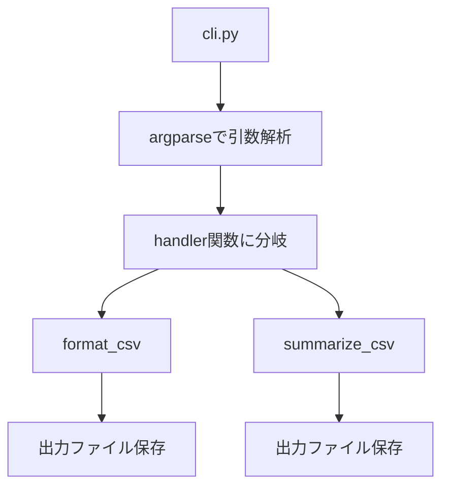

# autoscripts-csv

  
[](https://codecov.io/gh/yamanora/autoscripts_csv)

開発用Pythonテンプレート  
Poetry/pre-commit/pytest(+coverage) /CI

---

## セットアップ手順

```bash
poetry install --with dev
pre-commit install
```

---

## 使い方（例）

CLI モジュールが定義されている場合：

```bash
poetry run autoscripts-csv --help
```

---

## ファイル構成

```
autoscripts-csv/
├── src/
│   └── autoscripts_csv/          # パッケージ本体
│       ├── __init__.py
│       └── cli.py          # CLIのエントリーポイント
├── tests/                  # 単体テスト
│   └── test_dummy.py
├── .github/
│   └── workflows/
│       └── ci.yml          # CI設定
├── pyproject.toml
├── README.md
└── ...
```

---

処理構成のイメージ（Mermaid）：


