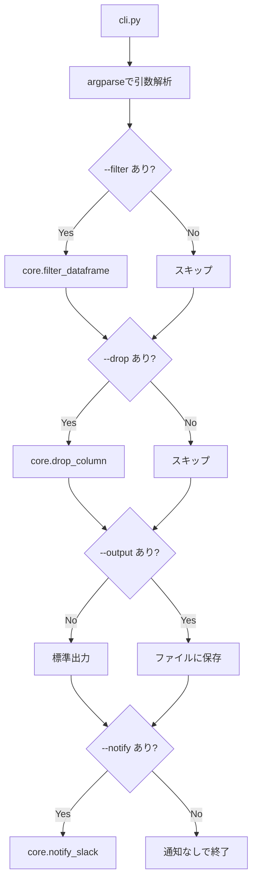

# autoscripts-csv

  
[](https://codecov.io/gh/yamanora/autoscripts-csv)

簡易的なCSVフィルター・整形ツール
Python + pandas によるコマンドラインツールです。
※本ツールは現在開発中です（一部機能は今後拡張予定）

Poetry / pre-commit / pytest(+coverage) / CI に対応。

---

## セットアップ手順

```bash
# 仮想環境を構築（dev依存も含めてインストール）
poetry install --with dev

# pre-commitを仮想環境から実行・インストール
poetry run pre-commit install
```

---

## 使い方（例）

```bash
poetry run autoscripts-csv -i <入力ファイル> [-o <出力ファイル>] [-f <列=値>] [-d <列名1,列名2,...>] [-n <Slackメッセージ>]
```

### 引数一覧

| 引数 | 必須 | 内容 | 例 |
|------|------|------|----|
| `-i`, `--input` | ✅ | 入力CSVファイル名 | `-i input.csv` |
| `-o`, `--output`  | 任意 | 出力ファイル名（省略時は標準出力） | `-o output.csv` |
| `-f`, `--filter` | 任意 | 指定列が特定の値と一致する行を抽出 | `-f 担当=佐藤` |
| `-d`, `--drop` | 任意 | 指定した列名を削除（カンマ区切りで複数可） | `-d 備考,メモ` |
| `-n`, `--notify` | 任意 | Slackにメッセージを通知 | `-n "通知成功"` |

※ `--filter` の複数指定や正規表現、AND/OR 条件などは未対応（今後拡張予定）  
※ `--drop` は存在しない列を指定してもスキップされます

---

## 入出力例

### 入力CSV（`input.csv`）

```csv
担当,実施,備考
佐藤,◯,
田中,◯,
佐藤,☓,
```

### 実行例

```bash
poetry run autoscripts-csv -i input.csv -o output.csv -f 担当=佐藤 -d 備考 -n "通知成功"
```

### 出力結果（標準出力 or output.csv）

```csv
担当,実施
佐藤,◯
佐藤,☓
```

---

## 環境変数（Slack通知用）

もしSlack通知が必要であれば、プロジェクトルートに `.env` を作成し以下を記述してください：

```
SLACK_WEBHOOK_URL=https://hooks.slack.com/services/...
```

---

## ファイル構成

```
autoscripts-csv/
├── src/
│   └── autoscripts_csv/        # パッケージ本体
│       ├── __init__.py
│       ├── cli.py              # CLIエントリーポイント
│       └── core/               # 処理ロジックモジュール
│           ├── filter.py       # 行フィルター処理
│           ├── drop.py         # 列削除処理
│           └── notify.py       # Slack通知処理
├── tests/                    # 単体テスト
│   └── test_core.py
├── .github/
│   └── workflows/
│       └── ci.yml            # CI設定
├── pyproject.toml
├── README.md
└── ...
```

---

## 処理構成（Mermaidイメージ）



---

## テスト・カバレッジ

```bash
poetry run pytest --cov
```

| ファイル | カバレッジ |
|----------|------------|
| `core/filter.py` | ✅ 100% |
| `core/drop.py`   | ✅ 100% |
| `core/notify.py` | ✅ 100% |
| `cli.py`         | ⚠️ テスト未実施（今後対応予定） |

---

## 今後の予定

- 複数フィルター条件対応
- 列順変更／サマリ出力対応

---

## ライセンス

MIT
